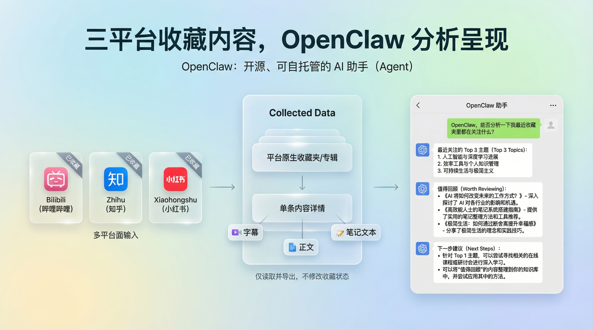
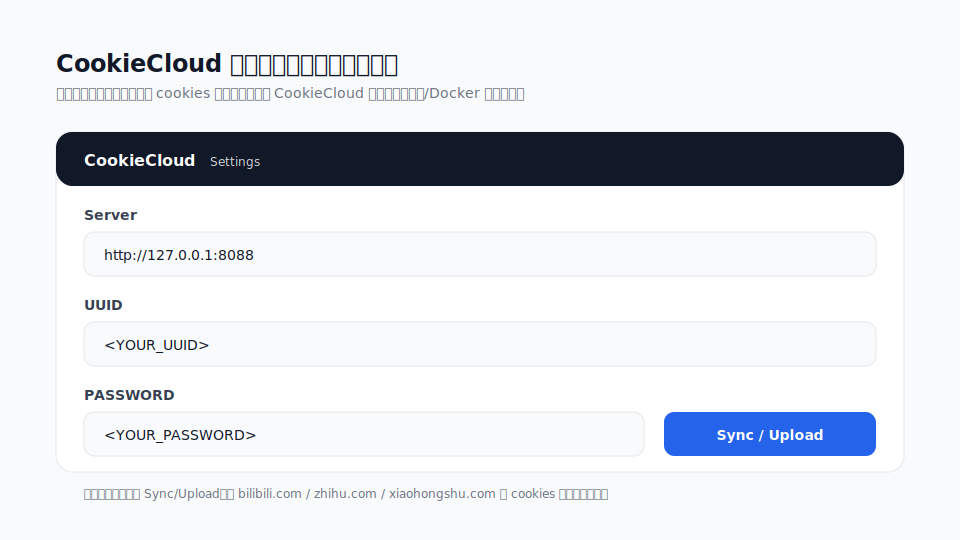
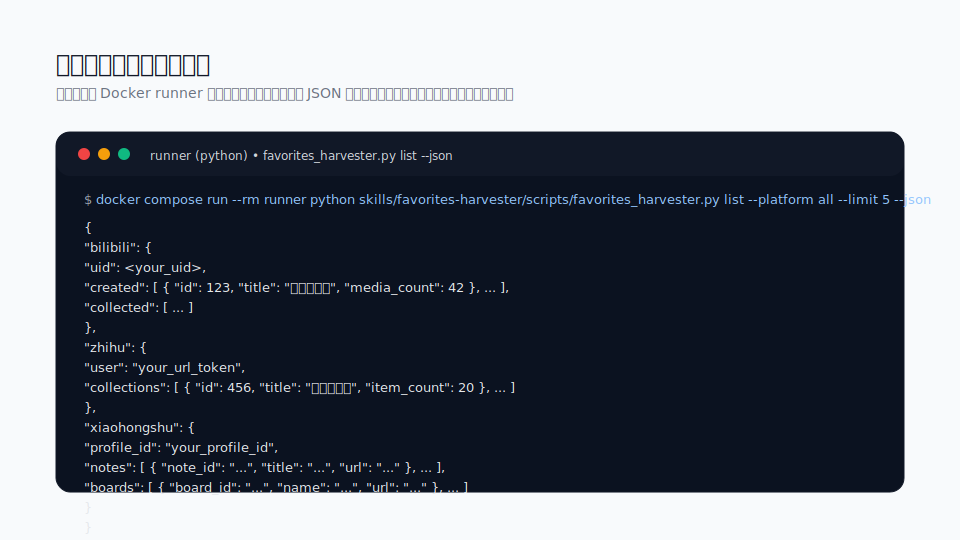

# 我的收藏 Skills（Bilibili / 知乎 / 小红书）



这是一组可复用的 **skills + 脚本**，用于拉取/查看你在各平台的收藏结构与内容（文件夹/收藏夹/专辑），并在需要时拿到“可用于总结的文本”（例如字幕逐字稿、文章正文、笔记文案）。

已支持（当前三平台）：
- **Bilibili**：收藏夹列表 + 收藏夹条目 + 视频字幕逐字稿（如有字幕）
- **知乎**：收藏夹列表 + 条目列表 + 回答/文章全文提取
- **小红书**：收藏笔记列表 + 收藏专辑/收藏夹（Boards）+ 笔记详情提取（Playwright 优先）

设计原则：
- **永远不依赖 RSSHub**。
- **API 优先**：能用官方/事实标准 Web API 的就不用浏览器（B站 / 知乎）。
- **Playwright 优先**：遇到签名/反爬/JS Challenge 的站点，优先用浏览器加载后读取 hydrated state / 网络数据，尽量避免脆弱的 DOM 解析（小红书）。

## 包含哪些 skills

- 平台原子 skill：
  - `skills/bilibili-favorites`
  - `skills/zhihu-favorites`
  - `skills/xiaohongshu-favorites`
- 聚合入口（路由器）：
  - `skills/favorites-harvester`（一个入口按 URL/平台分发到原子脚本）
- 可选媒体流水线（也是原子 skill，可组合使用）：
  - `skills/media-audio-download`（下载音频，用于转写）
  - `skills/whisper-transcribe-docker`（faster-whisper 本地转写，Docker 运行）

## 快速开始（Docker + CookieCloud，推荐）

这套仓库是 **Docker-first**：不要求你本机装 Python。

### CookieCloud 链接与说明

- CookieCloud 项目主页（服务端 + 浏览器插件）：https://github.com/easychen/CookieCloud
- Docker 镜像：`easychen/cookiecloud`
- 浏览器插件：在 Chrome Web Store / Edge 扩展商店搜索 `CookieCloud` 安装

CookieCloud 插件配置示意（脱敏示意图）：



1) 启动 CookieCloud（Docker）：
```bash
docker compose up -d cookiecloud
```

2) 在宿主机设置 CookieCloud 凭据（会透传进容器）：

PowerShell：
```powershell
$env:COOKIECLOUD_UUID="YOUR_UUID"
$env:COOKIECLOUD_PASSWORD="YOUR_PASSWORD"
```

Bash：
```bash
export COOKIECLOUD_UUID="YOUR_UUID"
export COOKIECLOUD_PASSWORD="YOUR_PASSWORD"
```

3) 浏览器 CookieCloud 插件配置：
- Server：`http://127.0.0.1:8088`
- UUID / PASSWORD：填你自己的
- 然后点一次同步/导出（让服务端拿到加密 cookie payload）

4) 构建 runner（包含 Playwright + Python 依赖）：
```bash
docker compose build runner
```

5) 一键列出三平台收藏容器（JSON）：
```bash
docker compose run --rm runner python skills/favorites-harvester/scripts/favorites_harvester.py list --platform all --json
```

更多用法见：
- `docs/cookiecloud.md`
- `docs/usage.md`

示例输出（脱敏示意图）：



## 常见需求怎么跑

1) “帮我看看 B 站最近收藏了哪些视频”
```bash
docker compose run --rm runner python skills/bilibili-favorites/scripts/bili_folders.py --json
# 选一个 media_id 后：
docker compose run --rm runner python skills/bilibili-favorites/scripts/bili_folder_items.py --media-id <folderId> --order mtime --limit 20 --json
```

2) “这条 B 站视频讲了啥（要逐字稿）”
- 先尝试字幕逐字稿（如果视频本身有字幕，这是最稳的“逐字稿”来源）：
```bash
docker compose run --rm runner python skills/bilibili-favorites/scripts/bili_video_transcript.py --url 'https://www.bilibili.com/video/BV...' --timestamps
```
- 如果提示没有字幕：走“下载音频 -> Whisper 转写”（见下方）。

3) “这篇知乎回答/文章讲了什么”
```bash
docker compose run --rm runner python skills/zhihu-favorites/scripts/zhihu_item_content.py --url 'https://www.zhihu.com/question/.../answer/...'
docker compose run --rm runner python skills/zhihu-favorites/scripts/zhihu_item_content.py --url 'https://zhuanlan.zhihu.com/p/...'
```

4) “小红书我收藏了哪些笔记/收藏专辑”
（遇到验证码/风控请加 `--no-headless`）
```bash
docker compose run --rm runner python skills/xiaohongshu-favorites/scripts/xhs_saved_notes.py --max 50 --json
docker compose run --rm runner python skills/xiaohongshu-favorites/scripts/xhs_boards.py --max 50 --json
```

## 视频/音频转写（Docker）

当平台没有字幕/没有可直接提取的逐字稿时，用这两个原子 skill 组合：

1) 下载音频（输出到 `./out`）：
```bash
mkdir -p out
docker compose run --rm media-audio-download --url 'https://www.bilibili.com/video/BV...'
```

2) faster-whisper 转写（写文件，带时间戳）：
```bash
docker compose run --rm -e HF_ENDPOINT=https://hf-mirror.com whisper-transcribe \
  /work/out/<audio>.m4a --model tiny --timestamps --out /work/out/<audio>.txt
```

说明：
- 第一次运行会下载模型权重（缓存到 `whisper-models` volume）。
- 如果你的网络可直连 Hugging Face，可以不传 `HF_ENDPOINT`。

## 注意事项 / 免责声明

- 本仓库通过 **你自己的登录 cookies** 访问 **你自己的账号数据**；cookies 属于敏感信息，请妥善保管。
- 请自行确保使用方式符合各平台的服务条款与当地法律法规。
- 若出现 captcha/403/空数据，通常需要重新同步 CookieCloud，或用 `--no-headless` 可视化调试。

## License

MIT（见 `LICENSE`）。 
